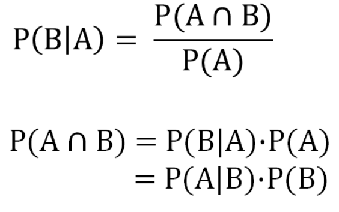
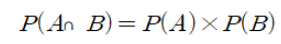
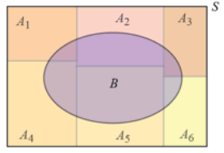
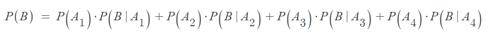

# 2장. 조건부 확률과 베이즈 정리

## 1. 조건부 확률

 **조건부 확률** : 사건 B가 일어났다는 조건하에 사건 A가 일어날 확률

 #### 아래 사진으로 식을 표현할 수 있으며 
 
  
 
 사건 A, B가 동시에 일어날 확률(A 교집합 B)은 
 - 사건 B가 일어났다는 조건하에 사건 A가 일어날 확률을 곱한 값과 같다.
 - 사건 A가 일어났다는 조건하에 사건 B가 일어날 확률을 곱한 값과 같다.

예를들어 어떤 사람이 독감 백신을 맞았다는 조건하에 독감에 걸릴 확률을 구해보면,  
어떤 사람이 독감 백신을 맞을 확률은 20%이고, 독감 백신을 맞고 독감에 걸릴 확률은 5%라고 가정한다면 이때 조건부 확률은 아래 식에 의해서 0.05/0.20가 되어 5/20 즉, 0.25가 된다.
  

 

## 2. 독립사건
**독립사건** : 한 사건의 발생이 다른 사건의 발생 확률에 영향을 주지 않을 때 두 사건은 독립이다.

따라서 사건 A, B가 독립이면 아래 식이 성립한다.

예를 들면 동전을 두번 던지는 시행을 했다고 하면 첫번째 동전던지기는 두번째 동전던지기에 영향을 주지 않으므로 서로 독립이다.  
만약 로또 처럼 순서를 고려하지 않기 때문에 combination 조합으로 계산하여 시행 횟수의 펙토리얼 값을 나눠야한다.

 

## 3. 전 확률 (Total Ptobability)

**전 확률** : 만약 B사건이 A사건들의 교집합으로 구성될 때 B사건의 확률

아래 그림처럼 표현할 수 있고

아래 식과 같이 표현할 수 있다.

예를 들어 어떤 학생이 우산을 가지고 학교에 갈 확률(A)은 30%. 우산을 가지고 간 경우 비가 올 확률(B|A)은 50$, 우산을 안 가지고 간 경우 비가 올 확률(B|A여집합)은 20%이다. 이때 비가 올 확률(B)은 얼마일까?

(조건부확률을 이용하여)위 처럼 계산하면 29%가 나오며 그림과 같이 나타낼 수 있다. 